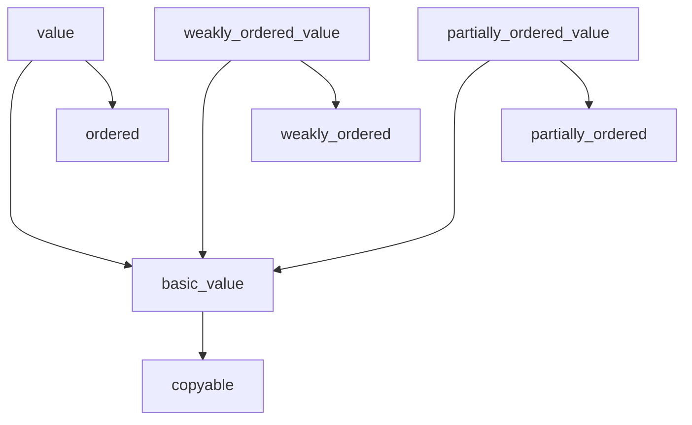

# Metafunctions

## Overview

A metafunction is a compile-time function that can participate in interpreting the meaning of a declaration, and can:

- apply defaults (e.g., `interface` makes functions virtual by default)

- enforce constraints (e.g., `value` enforces that the type has no virtual functions)

- generate additional functions and other code (e.g., `value` generates copy/move/comparison operations for a type if it didn't write them explicitly)

The most important thing about metafunctions is that they are not hardwired language features — they are compile-time library code that uses the reflection and code generation API, that lets the author of an ordinary type easily opt into a named set of defaults, requirements, and generated contents. This approach is essential to making the language simpler, because it lets us avoid hardwiring special "extra" types into the language and compiler.

## <a id="applying-metafunctions"></a> Applying metafunctions using `@`

Metafunctions provide an easy way for a type author to opt into a group of defaults, constraints, and generated functions: Just write `@name` afer the `:` of a declaration, where `name` is the name of the metafunction. This lets the type author declare (and the human reader see) the intent up front: "This isn't just any `type`, this is a `@value type`" which automatically gives the type default/copy/move construction and assignment, `<=>` with `std::strong_ordering` comparisons, and guarantees that it has a public destructor and no protected or virtual functions:

``` cpp title="Using the value metafunction when writing a type" hl_lines="1"
point2d: @value type = {
    x: i32 = 0;
    y: i32 = 0;
    // @value automatically generates default/copy/move
    // construction/assignment and <=> strong_ordering comparison,
    // and emits an error if you try to write a non-public
    // destructor or any protected or virtual function
}
```

## <a id="generating-source"></a>Generating source code at compile time

A metafunction applied to a definition using `@` gets to participate in interpreting the meaning of the definition by inspecting and manipulating the definition's parse tree. For example:

``` cpp title="shape.cpp2: Using @interface @print" hl_lines="1"
shape: @interface @print type = {
    draw   : (this);
    move_by: (this, dx: double, dy: double);
}
```

The above code:

- applies `@interface`, which makes functions pure virtual by default and defines a virtual destructor with a do-nothing body if there isn't already a virtual destructor (among other things), and

- then applies `@print`, which pretty-prints the resulting parse tree as source code to the console so that we can see the results of what the first metafunction did.

The result of compiling this is the following cppfront output, which is the `@interface`-modified Cpp2 source code as printed by `@print`:

``` cpp title="'cppfront shape.cpp2' output to the console, from @print" hl_lines="1"
shape:/* @interface @print */ type =
{
    public draw:(virtual in this);

    public move_by:(
        virtual in this,
        in dx: double,
        in dy: double
    );

    operator=:(virtual move this) =
    {
    }
}
```

Finally, cppfront also emits the following in `shape.cpp`:

``` cpp title="'cppfront shape.cpp' output to 'shape.cpp'"
class shape {
    public: virtual auto draw() const -> void = 0;
    public: virtual auto move_by(cpp2::in<double> dx, cpp2::in<double> dy) const -> void = 0;
    public: virtual ~shape() noexcept;

    public: shape() = default;
    public: shape(shape const&) = delete; /* No 'that' constructor, suppress copy */
    public: auto operator=(shape const&) -> void = delete;

};

shape::~shape() noexcept{}
```


## <a id="built-in-metafunctions"></a>Built-in metafunctions

The following metafunctions are provided in the box with cppfront.


### For regular value-like types (copyable, comparable)


#### <a id="ordered"></a>`ordered`, `weakly_ordered`, `partially_ordered`

An `ordered` (or `weakly_ordered` or `partially_ordered`) type has an `#!cpp operator<=>` three-way comparison operator that returns `std::strong_ordering` (or `std::weak_ordering` or `std::partial_ordering`, respectively). This means objects of this type can be used in all binary comparisons: `<`, `<=`, `==`, `!=`, `>=`, and `>`.

If the user explicitly writes `operator<=>`, its return type must be the same as the one implied by the metafunction they chose.

If the user doesn't explicitly write `operator<=>`, a default memberwise `operator<=>: (this, that) -> /* appropriate _ordering */;` will be generated for the type.

These metafunctions will emit a compile-time error if:

- a user-written `operator<=>` returns a different type than the one implied by the metafunction they chose

> Note: This feature derived from Cpp2 was already adopted into Standard C++ via paper [P0515](https://wg21.link/p0515), so most of the heavy lifting is done by the Cpp1 C++20/23 compiler, including the memberwise default semantics. In contrast, cppfront has to do the work itself for default memberwise semantics for operator= assignment as those aren't yet part of Standard C++.


#### `copyable`

A `copyable` type has (copy and move) x (construction and assignment).

If the user explicitly writes any of the copy/move `operator=` functions, they must also write the most general one that takes `(out this, that)`.

If the user doesn't write any of the copy/move `operator=` functions, a default general memberwise `operator=: (out this, that) = { }` will be generated for the type.

`copyable` will emit a compile-time error if:

- there is a user-written `operator=` but no user-written `operator=: (out this, that)`


#### <a id="value"></a>`basic_value`, `value`, `weakly_ordered_value`, `partially_ordered_value`

A `basic_value` type is a regular type: [`copyable`](#copyable), default constructible, and not polymorphic (no protected or virtual functions).

A `value` (or `weakly_ordered_value` or `partially_ordered_value`) is a `basic_value` that is also [`ordered`](#ordered) (or `weakly_ordered` or `partially_ordered`, respectively).



These metafunctions will emit a compile-time error if:

- any function is protected or virtual

- the type has a destructor that is not public


#### `struct`

A `struct` is a type with only public bases, objects, and functions, with no virtual functions, and with no user-defined constructors (i.e., no invariants) or assignment or destructors.

`struct` is implemented in terms of [`cpp1_rule_of_zero`](#cpp1_rule_of_zero).

`struct` will emit a compile-time error if:

- any member is non-public

- any function is virtual

- there is a user-written `operator=`


#### `hashable`

A `hashable` type provides a `hash: (this) -> size_t` function that performs a memberwise hash of its data members using `std::hash`.


### For polymorphic types (interfaces, base classes)


#### `interface`

An `interface` type is an abstract base class having only pure virtual functions.

Cpp2 has no `interface` feature hardwired into the language, as C# and Java do. Instead you apply the `@interface` metafunction when writing an ordinary `type`. For a detailed example, see [the `shape` example above](#generating-source-code-at-compile-time).

`interface` will emit a compile-time error if:

- the type contains a data object

- the type has a copy or move function (the diagnostic message will suggest a virtual `clone` function instead)

- any function has a body

- any function is nonpublic


#### `polymorphic_base`

A `polymorphic_base` type is a pure polymorphic base type that is not copyable, and whose destructor is either public and virtual or protected and nonvirtual.

Unlike an [interface](#interface), it can have nonpublic and nonvirtual functions.

`polymorphic_base` will emit a compile-time error if:

- the type has a copy or move function (the diagnostic message will suggest a virtual `clone` function instead)

- the type has a destructor that is not public and virtual, and also not protected and nonvirtual


### For enumeration types


#### `enum`

Cpp2 has no `enum` feature hardwired into the language. Instead you apply the `@enum` metafunction when writing an ordinary `type`.

`enum` will emit a compile-time error if:

- any member has the reserved name `operator=` or `operator<=>`, as these will be generated by the metafunction

- an enumerator is not public or does not have a deduced type

For example:

``` cpp title="Using the @enum metafunction when writing a type" hl_lines="14"
// skat_game is declaratively a safe enumeration type: it has
// default/copy/move construction/assignment and <=> with
// std::strong_ordering, a minimal-size signed underlying type
// by default if the user didn't specify a type, no implicit
// conversion to/from the underlying type, in fact no public
// construction except copy construction so that it can never
// have a value different from its listed enumerators, inline
// constexpr enumerators with values that automatically start
// at 1 and increment by 1 if the user didn't write their own
// value, and conveniences like to_string()... the word "enum"
// carries all that meaning as a convenient and readable
// opt-in, without hardwiring "enum" specially into the language
//
skat_game: @enum<i16> type = {
    diamonds := 9;
    hearts;  // 10
    spades;  // 11
    clubs;   // 12
    grand    := 20;
    null     := 23;
}
```

Consider `hearts`: It's a member object declaration, but it doesn't have a type (or a default value) which is normally illegal, but here it's okay because the `@enum<i16>` metafunction fills them in: It iterates over all the data members and gives each one the underlying type (here explicitly specified as `i16`, otherwise it would be computed as the smallest signed type that's big enough), and an initializer (by default one higher than the previous enumerator).

Unlike C `#!cpp enum`, this `@enum` is scoped and strongly typed (does not implicitly convert to the underlying type).

Unlike C++11 `#!cpp enum class`, it's "just a `type`" which means it can naturally also have member functions and other things that a type can have:

``` cpp title="An @enum type with a member function" hl_lines="1"
janus: @enum type = {
    past;
    future;

    flip: (inout this) == {
        if this == past { this = future; }
        else { this = past; }
    }
}
```


#### `flag_enum`

`flag_enum` is a variation on `enum` that has power-of-two default enumerator values, a default signed underlying type that is large enough to hold the values, and supports bitwise operators to combine and test values.

`flag_enum` will emit a compile-time error if:

- any member has the reserved name `operator=`, `operator<=>`, `has`, `set`, `clear`, `to_string`, `get_raw_value`, or `none`, as these will be generated by the metafunction

- an enumerator is not public or does not have a deduced type

- the values are outside the range that can be represented by the largest default underlying type

For example:

``` cpp title="Using the @flag_enum metafunction when writing a type" hl_lines="11"
// file_attributes is declaratively a safe flag enum type:
// same as enum, but with a minimal-size unsigned underlying
// type by default, and values that automatically start at 1
// and rise by powers of two if the user didn't write their
// own value, and bitwise operations plus .has(flags),
// .set(flags), and .clear(flags)... the word "flag_enum"
// carries all that meaning as a convenient and readable
// opt-in without hardwiring "[Flags]" specially into the
// language
//
file_attributes: @flag_enum<u8> type = {
    cached;     // 1
    current;    // 2
    obsolete;   // 4
    cached_and_current := cached | current;
}
```


### For dynamic types


#### `union`

`@union` declaratively opts into writing a safe discriminated union/variant dynamic type.

`union` will emit a compile-time error if:

- any alternative is not public or has an initializer

- any member starts with the reserved name prefix `is_` or `set_`, as these will be generated by the metafunction


For example:

``` cpp title="Using the @union metafunction when writing a type" hl_lines="10 18-20 25 26"
// name_or_number is declaratively a safe union/variant type:
// it has a discriminant that enforces only one alternative
// can be active at a time, members always have a name, and
// each member has .is_member(), .set_member(), and .member()
// accessors using the member name... the word "union"
// carries all that meaning as a convenient and readable
// opt-in without hardwiring "union" specially into the
// language
//
name_or_number: @union type = {
    name: std::string;
    num : i32;
}

main: () = {
    x: name_or_number = ();

    x.set_name("xyzzy");            // now x is a string
    assert( x.is_name() );
    std::cout << x.name();          // prints the string

    // trying to use x.num() here would cause a Type safety
    // contract violation, because x is currently a string

    x.set_num( 120 );               // now x is a number
    std::cout << x.num() + 3;       // prints 123
}
```

Unlike C `#!cpp union`, this `@union` is safe to use because it always ensures only the active type is accessed.

Unlike C++11 `std::variant`, this `@union` is easier to use because its alternatives are anonymous, and safer to use because each union type is a distinct type. [^variant]

Each `@union` type has its own type-safe name, has clear and unambiguous named members, and safely encapsulates a discriminator to rule them all. It uses type-unsafe casts in the implementation, but they are fully encapsulated, where they can be tested once and be safe in all uses.

Because a `@union type` is still a `type`, it can naturally have other things normal types can have, such as template parameter lists and member functions:

``` cpp title="A templated custom safe union type" hl_lines="1"
name_or_other: @union <T:type> type
= {
    name  : std::string;
    other : T;

    // a custom member function
    to_string: (this) -> std::string = {
        if is_name()       { return name(); }
        else if is_other() { return other() as std::string; }
        else               { return "invalid value"; }
    }
}

main: () = {
    x: name_or_other<int> = ();
    x.set_other(42);
    std::cout << x.other() * 3.14 << "\n";
    std::cout << x.to_string(); // prints "42" here, but is legal
                                // whichever alternative is active
}
```


### For computational and functional types


#### `regex`

A `regex` type has data members that are regular expression objects. This metafunction replaces all of the type's data members named `regex` or `regex_*` with regular expression objects of the same type. For example:

``` cpp title="Regular expression example"  hl_lines="1 3 4 16 17 19 27 30 31"
name_matcher: @regex type
= {
    regex         := R"((\w+) (\w+))";  // for example: Margaret Hamilton
    regex_no_case := R"(/(ab)+/i)";     // case insensitive match of "ab"+
}

main: (args) = {
    m: name_matcher = ();

    data: std::string = "Donald Duck";
    if args.ssize() >= 2 {
        data = args[1];
    }

    //  regex.match requires matches to match the entire string, from start to end
    result := m.regex.match(data);
    if result.matched {
        //  We found a match; reverse the order of the substrings
        std::cout << "Hello (result.group(2))$, (result.group(1))$!\n";
    }
    else {
        std::cout << "I only know names of the form: <name> <family name>.\n";
    }

    //  regex.search finds a match anywhere within the target string
    std::cout << "Case insensitive match: "
                 "(m.regex_no_case.search(\"blubabABblah\").group(0))$\n";
}
//  Prints:
//      Hello Duck, Donald!
//      Case insensitive match: abAB
```

The `@regex` metafunction currently supports most of [Perl regex syntax](https://perldoc.perl.org/perlre), except for Unicode characters and the syntax tokens associated with them. See [Supported regular expression features](../notes/regex_status.md) for a list of regex options.

Each regex object has the type `cpp2::regex::regular_expression`, which is defined in `include/cpp2regex.h2`. The member functions are:

``` cpp title="Member functions for regular expressions"
//  .match() requires matches to match the entire string, from start to end
//  .search() finds a match anywhere within the target string

match :        (this, str: std::string_view)                -> search_return;
search:        (this, str: std::string_view)                -> search_return;

match :        (this, str: std::string_view, start)         -> search_return;
search:        (this, str: std::string_view, start)         -> search_return;

match :        (this, str: std::string_view, start, length) -> search_return;
search:        (this, str: std::string_view, start, length) -> search_return;

match : <Iter> (this, start: Iter, end: Iter)               -> search_return;
search: <Iter> (this, start: Iter, end: Iter)               -> search_return;
```

The return type `search_return` is defined in `cpp2::regex::regular_expression`. It has these members:

``` cpp title="Members of a regular expression result"
matched: bool;
pos:     int;

//  Functions to access groups by number
group_number: (this) -> size_t;;
group:        (this, g: int) -> std::string;
group_start:  (this, g: int) -> int;
group_end:    (this, g: int) -> int;

//  Functions to access groups by name
group:        (this, g: bstring<CharT>) -> std::string;
group_start:  (this, g: bstring<CharT>) -> int;
group_end:    (this, g: bstring<CharT>) -> int;
```


### Helpers and utilities


#### `cpp1_rule_of_zero`

A `cpp1_rule_of_zero` type is one that has no user-written copy/move/destructor functions, and for which Cpp2 should generate nothing so that the Cpp1 defaults for generated special member functions are accepted.

> C.20: If you can avoid defining default operations, do.
> Reason: It's the simplest and gives the cleanest semantics.
> This is known as "the rule of zero".
> — Stroustrup, Sutter, et al. (C++ Core Guidelines)


#### `print`

`print` prints a pretty-printed visualization of the type to the console.

This is most useful for debugging metafunctions, and otherwise seeing the results of applying previous metafunctions.

For a detailed example, see [the `shape` example above](#generating-source-code-at-compile-time).


[^variant]: With `variant`, there's no way to distinguish in the type system between a `variant<int,string>` that stores either an employee id or employee name, and a `variant<int,string>` that stores either a lucky number or a pet unicorn's dominant color.
