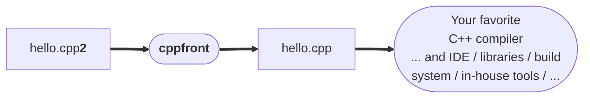

# **Hello, world!**



## <a id="hello-cpp2"></a> A `hello.cpp2` program

Here is the usual one-line starter program that prints `Hello, world!`. Note that this is a complete program, no `#!cpp #include` required:

``` cpp title="hello.cpp2 — on one line"
main: () = std::cout << "Hello, world!\n";
```

But let's add a little more, just to show a few things:

``` cpp title="hello.cpp2 — slightly more interesting"
main: () = {
    words: std::vector = ( "Alice", "Bob" );
    hello( words[0] );
    hello( words[1] );
}

hello: (msg: std::string_view) = {
    std::cout << "Hello, (msg)$!\n";
}
```

This short program code already illustrates a few Cpp2 essentials.

**Consistent context-free syntax.** Cpp2 is designed so that there is one general way to spell a given thing, that works consistently everywhere. All Cpp2 types/functions/objects/namespaces are written using the unambiguous and context-free [declaration syntax](../cpp2/declarations.md) **"_name_ `:` _kind_ `=` _statement_"**. The `:` is pronounced **"is a,"** and the `=` is pronounced **"defined as."**

- `main` **is a** function that takes no arguments and returns nothing, and is **defined as** the code body shown.

- `words` **is a** `std::vector`, initially **defined as** holding `#!cpp "Alice"` and `#!cpp "Bob"`.

- `hello` **is a** function that takes a `std::string_view` it will only read from and that returns nothing, and is **defined as** code that prints the string to `cout` the usual C++ way.

All grammar is context-free. In particular, we (the human reading the code, and the compiler) never need to do name lookup to figure out how to parse something — there is never a ["vexing parse"](https://en.wikipedia.org/wiki/Most_vexing_parse) in Cpp2. For details, see [Design note: Unambiguous parsing](https://github.com/hsutter/cppfront/wiki/Design-note%3A-Unambiguous-parsing).

**Simple, safe, and efficient by default.** Cpp2 has contracts (tracking draft C++26 contracts), `inspect` pattern matching, string interpolation, automatic move from last use, and more.

- <a id="ctad"></a> Declaring `words` uses **"CTAD"** (C++'s normal [constructor template argument deduction](https://en.cppreference.com/w/cpp/language/class_template_argument_deduction)) to deduce the type of elements in the `vector`.

- Calling `#!cpp words[0]` and `#!cpp words[1]` is **bounds-checked by default**. From Cpp2 code, ordinary `std::vector` subscript accesses are safely bounds-checked by default without requiring any upgrade to your favorite standard library, and that's true for any similar subscript of something whose size can be queried using `std::size()` and `std::ssize()`, and for which `std::begin()` returns a random access iterator, including any in-house integer-indexed container types you already have that can easily provide `std::size()` and `std::ssize()` if they don't already.

- `hello` uses **string interpolation** to be able to write `#!cpp "Hello, (msg)$!\n"` instead of `#!cpp "Hello, " << msg << "!\n"`. String interpolation also supports [standard C++ format specifications](https://en.cppreference.com/w/cpp/utility/format/spec), so you won't need iostream manipulators.

**Simplicity through generality + defaults.** A major way that Cpp2 delivers simplicity is by providing just one powerful general syntax for a given thing (e.g., one function definition syntax), but designing it so you can omit the parts you're not currently using (e.g., where you're happy with the defaults). We're already using some of those defaults above:

- We can omit writing the `#!cpp -> void` return type for a function that doesn't return anything, as both of these functions do.

- We can omit the `{` `}` around single-statement function bodies, as `hello` does.

- We can omit the `in` on the `msg` parameter. Cpp2 has just six ways to pass parameters: The most common ones are `in` for read-only (the default so we can omit it, as `hello` does), and `inout` for read-write.  The others are `copy`, `out`, `move`, and `forward`.

For details, see [Design note: Defaults are one way to say the same thing](https://github.com/hsutter/cppfront/wiki/Design-note%3A-Defaults-are-one-way-to-say-the-same-thing).

**Order-independent by default.** Did you notice that `main` called `hello`, which was defined later? Cpp2 code is order-independent by default — there are no forward declarations.

**Seamless compatibility and interop.** We can just use `std::cout` and `#!cpp std::operator<<` and `std::string_view` directly as usual. Cpp2 code works with any C++ code or library, including the standard library, using ordinary direct calls without any wrapping/marshaling/thunking.

**C++ standard library is always available.** We didn't need `#!cpp #include <iostream>` or `#!cpp import std;`. The full C++ standard library is always available by default if your source file contains only syntax-2 code and you compile using cppfront's `-p` (short for `-pure-cpp2`), or if you use `-im` (short for `-import-std`). Cppfront is regularly updated to be compatible with C++23 and the latest draft C++26 library additions as soon as the ISO C++ committee votes them into the C++26 working draft, so as soon as you have a C++ implementation that has a new standard (or bleeding-edge draft standard!) C++ library feature, you'll be able to fully use it in Cpp2 code.


## <a id="build-hello-cpp2"></a> Building `hello.cpp2`

Now use `cppfront` to compile `hello.cpp2` to a standard C++ file `hello.cpp`:

``` bash title="Call cppfront to produce hello.cpp"
cppfront hello.cpp2 -p
```

The result is an ordinary C++ file that looks like this: [^clean-cpp1]

``` cpp title="hello.cpp — created by cppfront" linenums="1"
#define CPP2_IMPORT_STD          Yes

#include "cpp2util.h"

auto main() -> int;

auto hello(cpp2::in<std::string_view> msg) -> void;
auto main() -> int{
    std::vector words {"Alice", "Bob"};
    hello(CPP2_ASSERT_IN_BOUNDS_LITERAL(words, 0));
    hello(CPP2_ASSERT_IN_BOUNDS_LITERAL(std::move(words), 1));
}

auto hello(cpp2::in<std::string_view> msg) -> void {
    std::cout << ("Hello, " + cpp2::to_string(msg) + "!\n");  }
```

Here we can see more of how Cpp2 makes its features work.

**How: Consistent context-free syntax.**

- **All compiled lines are portable C++20 code** we can build with pretty much any C++ compiler released circa 2019 or later. Cpp2's context-free syntax converts directly to today's Cpp1 syntax. We can write and read our C++ types/functions/objects in simpler Cpp2 syntax without wrestling with context sensitivity and ambiguity, and they're all still just ordinary types/functions/objects.

**How: Simple, safe, and efficient by default.**

- **Line 9: CTAD** just works, because it turns into ordinary C++ code which already supports CTAD.
- **Lines 10-11: Automatic bounds checking** is added to `#!cpp words[0]` and `#!cpp words[1]` nonintrusively at the call site by default. Because it's nonintrusive, it works seamlessly with all existing container types that are `std::size` and `std::ssize`-aware, when you use them from safe Cpp2 code.
- **Line 11: Automatic move from last use** ensures the last use of `words` will automatically avoid a copy if it's being passed to something that's optimized for rvalues.
- **Line 15: String interpolation** performs the string capture of `msg`'s current value via `cpp2::to_string`. That uses `std::to_string` when available, and it also works for additional types (such as `#!cpp bool`, to print `#!cpp false` and `#!cpp true` instead of `0` and `1`, without having to remember to use `std::boolalpha`).

**How: Simplicity through generality + defaults.**

- **Line 7: `in` parameters** are implemented using `#!cpp cpp2::in<>`, which is smart enough to pass by `#!cpp const` value when that's safe and appropriate, otherwise by `#!cpp const&`, so you don't have to choose the right one by hand.

**How: Order-independent by default.**

- **Lines 5 and 7: Order independence** happens because cppfront generates all the type and function forward declarations for you, so you don't have to. That's why `main` can just call `hello`: both are forward-declared, so they can both see each other.

**How: Seamless compatibility and interop.**

- **Lines 9-11 and 15: Ordinary direct calls** to existing C++ code, so there's never a need for wrapping/marshaling/thunking.

**How: C++ standard library always available.**

- **Lines 1 and 3: `std::` is available** because cppfront was invoked with `-p`, which implies either `-im` (short for `-import-std`) or `-in` (short for `-include-std`, for compilers that don't support modules yet). The generated code tells `cpp2util.h` to `#!cpp import` the entire standard library as a module (or do the equivalent via headers if modules are not available).


## <a id="build-hello-cpp"></a> Building and running `hello.cpp` with any recent C++ compiler

Finally, just build `hello.cpp` using your favorite C++20 compiler, where `CPPFRONT_INCLUDE` is the path to `/cppfront/include`:

<image align="right" width="120" src="https://user-images.githubusercontent.com/1801526/188906112-ef377a79-b6a9-4a30-b318-10b51d8ea934.png">

``` title="MSVC (Visual Studio 2019 version 16.11 or higher)"
> cl hello.cpp -std:c++20 -EHsc -I CPPFRONT_INCLUDE
> hello.exe
Hello, world!
```

``` bash title="GCC (GCC 10 or higher)"
$ g++ hello.cpp -std=c++20 -ICPPFRONT_INCLUDE -o hello
$ ./hello.exe
Hello, world!
```

``` bash title="Clang (Clang 12 or higher)"
$ clang++ hello.cpp -std=c++20 -ICPPFRONT_INCLUDE -o hello
$ ./hello.exe
Hello, world!
```


### &#10148; Next: [Adding cppfront to your existing C++ project](integration.md)


[^clean-cpp1]: For presentation purposes, this documentation generally shows the `.cpp` as generated when using cppfront's `-cl` (short for `-clean-cpp1`), which suppresses extra information cppfront normally emits in the `.cpp` to light up C++ tools (e.g., to let IDEs integrate cppfront error message output, debuggers step to the right lines in Cpp2 source code, and so forth). In normal use, you won't need or even want `-cl`.
